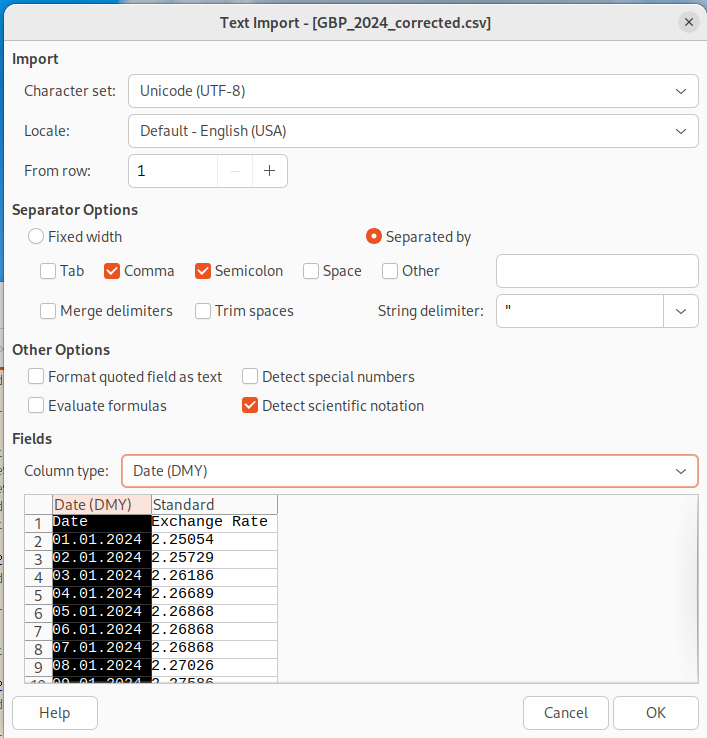
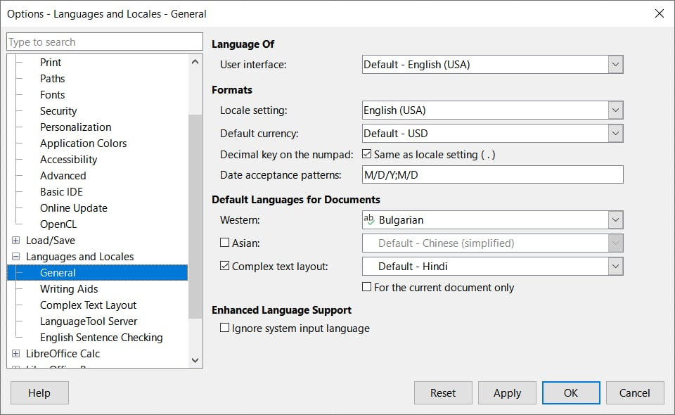
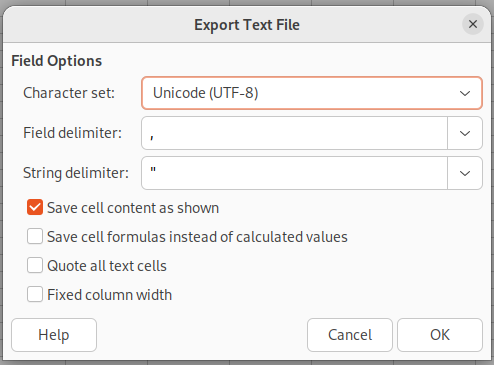
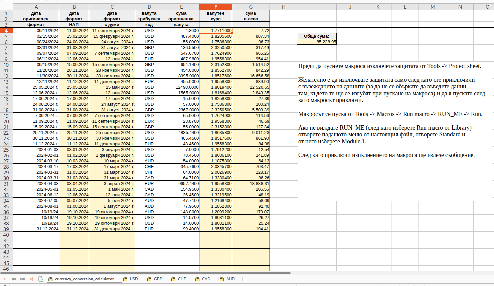
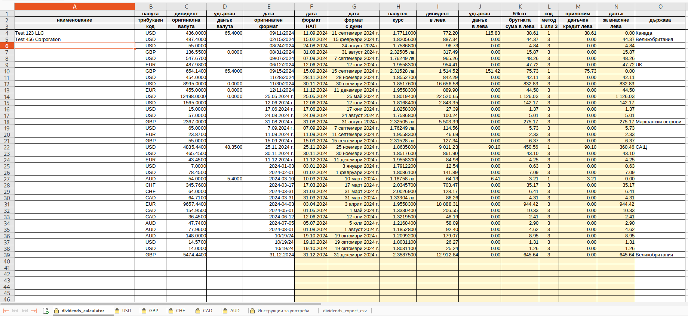
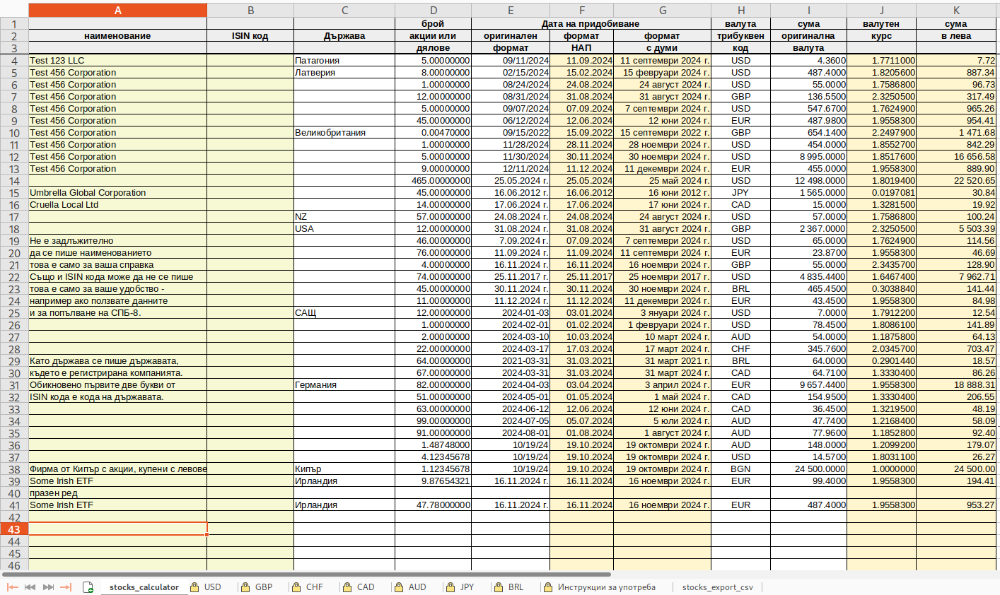
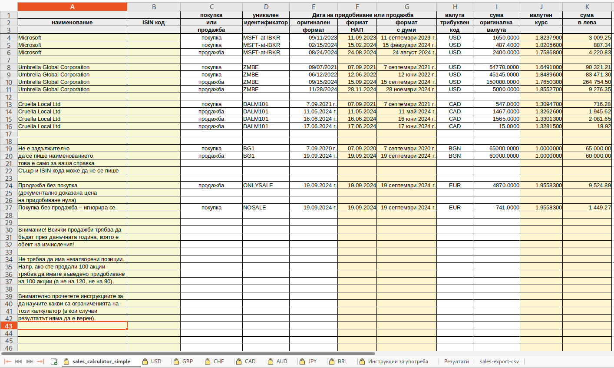
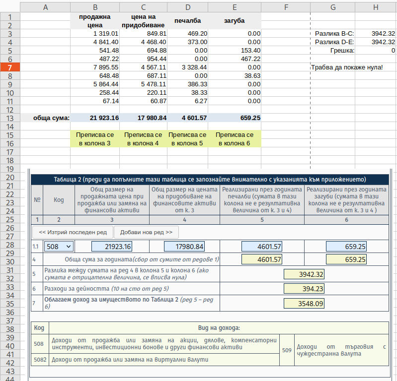
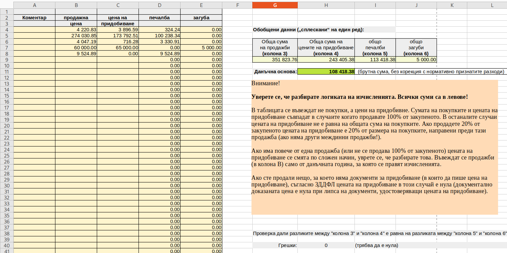

# Електронни таблици (работят с LibreOffice Calc)

Таблиците, в които има макроси, работят с LibreOffice (тествах ги с LibreOffice 24.8.3.2 и 24.8.5.2, би трябвало да работят с всички близки до тези версии). Не мисля, че макросите ще работят в Excel, трябва да ползвате LibreOffice (не съм тествал с OpenOffice.org). Таблиците само с формули би трябвало да работят с всяка програма, която отваря .ods файлове (вкл. и Excel). Таблиците с макроси също би трябвало да се отварят с Excel и всяка програма, отваряща .ods, но макросите ще работят само с някои версии на LibreOffice.

Във файловете са вградени валутните курсове за няколко популярни валути. Може да добавите нова валута просто като добавите нов sheet със заглавие трибуквения код на валутата. Автоматичното изчисление няма да работи ако пропуснете да форматирате правилно колоните с датата и валутните курсове. За да не излизат датите като стрингове (със символ ' в началото) трябва при импорта да се зададе тип на колоната "дата (DMY)":

Column type: Date (DMY)

 

Не забравяйте, че някои валутни курсове от сайта на БНБ са не за 1 единица, а за 10, 100 или 1000 валутни единици (проверете на сайта на БНБ кои са тези валути). Тоест числата от втората колона трябва да се разделят на 10, 100 или 1000 за да се получи валутния курс за 1 валутна единица. Скриптът `BNB_downloader.py` коригира валутния курс така, че да е за 1 валутна единица, ако теглите валутните курсове с друг инструмент не забравяйте да ги коригирате (за да бъдат за 1 валутна единица).

Оказа се, че макросите не работят коректно под Windows ако не коригирате езиковите настройки да бъдат така:

Тази снимка на екрана ми я прати потребител, който тества с версия 24.8.6.2 на LibreOffice под Windows. Първоначално не работеше, даваше грешки `Err:508` и `Err:509` при работа с езикови настройки на български (взети по подразбиране от Windows с бъгларски езикови настройки).

Преди да промените езиковите настройки затворете всички отворени таблици, отворете LibreOffice Calc без да отваряте таблица, променете езиковите настройки, затворете LibreOffice Calc, отворете го наново за да потвърдите, че езиковите настройки са като на снимката на екрана по-горе. Ако не са - променете ги на някой друг език и ги върнете обратно на English, затворете LibreOffice Calc и го отворете пак. Проверете езиковите настройки - вече трябва да са правилните. След това може да пристъпите към отваряне на електронна таблица за да проверите дали работи.

При българския локал сепараторът във формулите трябва да е `;` ето така (за ред 16):

    =ROUND(I16*J16;2)

При английския локал сепараторът е `,` (запетая):

    =ROUND(I16*J16,2)

Изглежда, че от там идва проблема.

За да експортирате csv файл за nap-autopilot селектирайте sheet-а с данните за експортиране (импортиране от nap-autopilot), от менюто "File" изберете "Save a copy" и след като потвърдите записване на .csv файл ще ви излезе такъв диалог:

Уверете се, че кодирането е UTF-8.

При ползване на функцията "Save a copy" ще бъде записан само текущо избрания sheet в нов файл, като продължавате редакцията на съществуващия .ods файл.

## Електронна таблица за изчисляване на доход в друга валута

Електронната таблица currency_conversion_calculator.ods работи с LibreOffice (тествах я с LibreOffice 24.8.3.2 и 24.8.5.2).

Предназначена е за прости изчисления (напр. доходи от [лихви, които се декларират в приложение 6](https://redtapepayments.blogspot.com/2025/03/wise-revolut-trading212-interactive.html) и доходи от категорията "други" - пак в приложение 6).

 

Потребителят въвежда датата в желания от него формат (ползва се функцията на електронната таблица за форматиране на дата), трибуквения код на валутата (USD, EUR, GBP и т.н.) и сумата в тази валута. Таблицата автоматично взима правилния валутен курс и изчислява общата сума на дохода в лева.

След като потребителят въведе данните (преди да пусне макроса) трябва да изключи защитата от Tools -> Protect sheet.

Желателно е да изключвате защитата само след като сте приключили с въвеждането на данните (за да не се объркате да въведете данни там, където те ще се изгубят при пускане на макроса) и да я пускате след
като макросът приключи.

Макросът се пуска от Tools -> Macros -> Run macro -> RUN_ME -> Run.

Ако не виждате RUN_ME (след като изберете Run macro от Library) отворете падащото меню от настоящия файл, отворете Standard и от него изберете Module 1.

След като приключи изпълнението на макроса ще излезе съобщение.

  
Допълнителна информация за закръгляването на междинните резултати (кликни тук за да се отвори текста)

Ако имате дребни суми в чужда валута и искате да проверите какъв резултат ще има ако междинните резултати (колона G) са закръглени не до втория знак, а до четвъртия или осмия знак след десетичната запетая:

Намерете този ред в кода на макроса:

    sFormulaG = "=ROUND(E" & (nRow + 1) & "*F" & (nRow + 1) & ",2)"

И го редактирайте така (цифрата 2 във втория параметър става 4):

    sFormulaG = "=ROUND(E" & (nRow + 1) & "*F" & (nRow + 1) & ",4)"

За закръгляване до осмия знак:

    sFormulaG = "=ROUND(E" & (nRow + 1) & "*F" & (nRow + 1) & ",8)"

В инструкциите за попълване на данъчната декларация пише, че се попълва в левове и стотинки (освен когато не е уточнено друго - на места се пише във валута). Закръглянето е до втория знак в данните, които се декларират. Но нищо не пише за междинните резултати. В някои случаи (лихви от порядъка на няколко цента на ден) се получава голяма (като процент) разлика. Може да сметнете общата сума по няколко начина (закръглявания на междинните резултати от колона G) и да декларирате най-голямата сума за да не се притеснявате, че при проверка ще оспорят начина в на изчисление (когато сте платили по-голям данък няма глоба, глобата е ако сте укрили данък). Алтернативно, ако не ви се занимава да смятате по различни начини, може просто да ползвате закръгляването до втория знак на междинните резултати и ако имате 365 реда с доходи да добвите 365 стотинки (3 лева и 65 стотинки) в резултата и така със сигурност няма да сте укрили данък заради грешки в изчисленията.

Принципно от НАП не би трябвало да се заяждат заради закръгляванията на междинните резултати така че може да пропуснете занимавката с по-прецизни изчисления и просто да ползвате таблицата катко е по подразбиране - със закръгляване до втория знак. Закръгляването на междинните резултати до втория знак е утвърдена практика. Ако имате доходи от 1 цент даже ще е в полза на НАП закръглянето когато 1 цент е 1,50 лв или повече (но под 2 лева).

## Електронна таблица за дивиденти [приложение 8 на годишната данъчна декларация]

Електронната таблица dividends_calculator.ods работи с LibreOffice (тествах я с LibreOffice 24.8.3.2 и 24.8.5.2).

Предназначена е за доходи от дивиденти. Ако има удържан дивидент приема, че е код 1 (обикновен данъчен кредит), в противен случай приема код 3. (Което формално не е правилно, но не е съществен недостатък, сложно е за обяснение, за подробности - вижте страницата на [nap-autopilot](https://github.com/vstoykovbg/nap-autopilot), където го обясних).

Ползва се една и съща дата за превалутиране както на получения дивидент, така и на удържания данък. Не съм виждал случай когато данъкът е удържан на дата, която е различна от датата на дивидента.

Изчислява повече колони, отколкото са необходими за [nap-autopilot](https://github.com/vstoykovbg/nap-autopilot) (тоест може ако желаете ръчно да препишете съответните числа в годишната данъчна декларация, ако по някаква причина не искате да ползвате nap-autopilot).

 

Преди да пуснете макроса изключете защитата на **dividends_calculator** от Tools -> Protect sheet.

Обърнете внимание, че преди да изберете Tools -> Protect sheet трябва да сте избрали dividends_calculator, а не "Инструкции за употреба".

Желателно е да изключвате защитата само след като сте приключили с въвеждането на данните (за да не се объркате да въведете данни там, където те ще се изгубят при пускане на макроса) и да я пускате след като макросът приключи.

Макросът се пуска от Tools -> Macros -> Run macro -> RUN_ME -> Run.

Ако не виждате RUN_ME (след като изберете Run macro от Library) отворете падащото меню от настоящия файл, отворете Standard и от него изберете Module 1.

След като приключи изпълнението на макроса ще излезе съобщение.

RUN_ME_with_cleaning прави същото като RUN_ME с тази разлика, че изчиства редовете на колони F, G, H, I, J, K, L, M, N до 100 реда надолу от последната дата в колона E (с цел оптимизация е ограничена проверката за въведени данни). Ако има празнина от повече от 100 реда в колона E следващите редове се игнорират.

След изпълнение на макроса можете да запазите **dividends_export_csv** във формат CSV с цел да захраните [nap-autopilot](https://github.com/vstoykovbg/nap-autopilot) (автоматично въвеждане на данни в данъчната декларация).

Някои инвестиционни посредници позволяват да се генерират справки в CSV формат или друг подобен. Например в Interactive Brokers може да се генрира справка в csv формат за дивидентите и от там много, ама много внимателно, да се копират с copy/paste колоните с дивидентите, данъците върху дивидентите и датите в съответните колони на dividends_calculator.ods. Допълнение: няма нужда от това, вече имам скрипт, който да обработва данните.

Може да има усложнения като връщане на данък и наново начисляване на данък, така че много трябва да се внимава при тази операция (да не се получи разминаване на редовете).

Преди да paste-нете датите форматирайте съответните полета в съответния формат.

Много внимателно попълнете трибуквения код на валутата на всеки ред (да не объркате дивидентите в евро с дивиденти в долари и т.н.).

В таблицата е предвидено, че дивидентите и данъците върху съответните дивиденти са платени на една и съща дата. Не се сещам за случаи когато това не е така, но все пак проверете дали във вашия случай няма разлика.

## Електронна таблица за притежавани акции (или дялове) [приложение 8 на годишната данъчна декларация]

Електронната таблица stocks_calculator.ods работи с LibreOffice (тествах я с LibreOffice 24.8.3.2 и 24.8.3.2).

Предназначена е за подпомагане попълването на таблиците в приложение 8 за притежаваните акции и дялове. Подпомага генерирането на CSV файл за nap-autopilot.

 

Преди да пуснете макроса изключете защитата на stocks_calculator от Tools -> Protect sheet.

Обърнете внимание, че преди да изберете Tools -> Protect sheet трябва да сте избрали stocks_calculator, а не "Инструкции за употреба".

Желателно е да изключвате защитата само след като сте приключили с въвеждането на данните (за да не се объркате да въведете данни там, където те ще се изгубят при пускане на макроса) и да я пускате след като макросът приключи.

Въвеждането на наименование и ISIN код не е задължително (но е полезно при проверка дали правилно сте въвели данните и за евентуално попълване на СПБ-8).

Макросът се пуска от Tools -> Macros -> Run macro -> RUN_ME -> Run.

Ако не виждате RUN_ME (след като изберете Run macro от Library) отворете падащото меню от настоящия файл, отворете Standard и от него изберете Module 1.

След като приключи изпълнението на макроса ще излезе съобщение.

RUN_ME_with_cleaning прави същото като RUN_ME с тази разлика, че изчиства редовете на колони F, G, J, K до 100 реда надолу от последната дата в колона E (с цел оптимизация е ограничена проверката за въведени данни). Ако има празнина от повече от 100 реда в колона E следващите редове се игнорират.

След изпълнение на макроса можете да запазите stocks_export_csv във формат CSV с цел да захраните [nap-autopilot](https://github.com/vstoykovbg/nap-autopilot) (автоматично въвеждане на данни в данъчната декларация).

(Преименувах shares_calculator.ods на stocks_calculator.ods, защото в почти всички случаи притежаваните акции/дялове към 31 декември се декларират като акции. При запазване на csv файл с LibreOffice файловото име по подразбиране ще започва вече със **stocks, което е правилното име ако искаме nap-autopilot да въведе тези данни в таблицата за акциите**, а не за дяловете. Преди потребителите по инерция запазваха файла с име, започващо със shares, което водеше до вкарването на данните в таблицата за дялове, а не за акции.)

## Електронна таблица за доходи с код 508 и 5082 (опростена, изчисляваща правилно само ако въведените данни отговарят на определени критерии) [приложение 5 на годишната данъчна декларация]

Електронната таблица sales_calculator_simple.ods работи с LibreOffice (тествах я с LibreOffice 24.8.3.2 и 24.8.5.2).

Предназначена е за доходите с код 508 и 5082 (таблица 2 от приложение 5). Подпомага генерирането на CSV файл за nap-autopilot.

В декларацията за 2024 година доходите от криптовалути са с отделен код (5082), поради което не трябва да ги слагате в една таблица с доходите с код 508. Изчисляват се по същия начин (но отделно от доходите с код 508).

> [!WARNING]
> Внимание! Запознайте се с логиката на изчисления в този калкулатор за да разберете какви са му ограниченията.

* Калкулаторът няма да изведе коректен резултат ако въведете покупки на активи, които не са продадени изцяло през данъчната година, която е обект на изчисления.
* Ако има въведени продажби през други данъчни години резултатът от изчисленията няма да е правилен.
* Този калкулатор работи правилно само при условие, че въведените покупки се отнасят изцяло за въведените продажби.

Допустимо е за някой идентификатор да има въведена само продажба (например, ако има продадени опции или е продадено нещо, за което няма документи за придобиване. Съгласно ЗДДФЛ цената на придобиване в този случай е нула (документално доказаната цена е нула при липса на документи, удостоверяващи цената на придобиване).

Ако за някой идентификатор няма въведени продажби той се игнорира.

Нарочно не употребявам израза данъчен лот, а уникален идентификатор, защото калкулаторът работи правилно и когато няма данъчни лотове, но само ако условията са изпълнени.

**Тип сделки, които калкулаторът ще обработи правилно:**

1. Прости покупко-продажби - една покупка и една продажба като с продажбата се продава изцяло това, което е купено (и продажбата е направена през годината, за която се отнасят изчисленията).
2. Сложни покупко-продажби (покупка/покупки, последвани от продажба/продажби), но позициите са изцяло затворени през данъчната година, за която се отнасят изчисленията.   

(Възможно е продажбите да са накъсо, но само при условие, че доходът е реализиран през данъчната година, за която се отнася данъчната декларация. Когато покупките за затваряне на късите позиции и продажбите за отваряне на късите позиции са през данъчната година, за която се отнасят изчисленията, няма неснота. Но ЗДДФЛ не утонява изрично кога е реализиран дохода при къси продажби - годината когато е отворена късата позиция или годината когато е затворена късата позиция. За да се избегне този проблем избягвайте да държите късите позиции в следваща данъчна година.)

Какво значи изцяло затворена позиция? Пример: купуваме 10 акции, после още 10. Имаме дълга позиция от 20 акции. През 2024 година (за която правим изчисленията на доходите) продаваме 15 акции. Това не е изцяло затворена позиция. Продаваме още 5 акции през 2024 година - с това затваряме изцяло позицията (продали сме всичко което сме купили).

Пример за stock split: Няма проблем ако е имало stock split, например купили сме 20 акции, след сплит (акциите са се разцепили на 10) имаме 200 акции. Ако изцяло продадем тези 200 акции през данъчната година, за която се отнасят изчисленията (и правилно сме въвели цената на придобиване на 20-те акции), калкулаторът ще изведе коректен резултат. В калкулатора не е предвидено да се въвежда брой на акциите.

**Тип сделки, които калкулаторът няма да обработи правилно:**

1. Продажба (или продажби) през предишна данъчна година.
   (Тоест дългите позиции, описани като покупки, са затворени напълно или частично през предишна данъчна година, а не през данъчната година, за която се отнасят изчисленията.)
2. Покупки на активи, които не са продадени изцяло през данъчната година, за която се правят изчисленията.
   (Тоест дългите позиции, описани като покупки, са затворени само частично. Ако изобщо няма продажби макросът игнорира тези идентификатори - тогава не е проблем да ги има покупките, но няма смисъл да се въвеждат.)

Пример за ненапълно затворена позиция (грешно ползване на калкулатора): Купили сме 10 акции през 2023 година и сме написали цената на придобиване на тези 10 акции в калкулатора като покупка. Продаваме 5 акции през 2024 година (за която се отнасят изчисленията) и въвеждаме продажната цена на тези 5 акции в калкулатора като продажба. Резултатът ще бъде грешен, защото не е коректно да вадим от продажната цена на 5 акции цената на придобиване на 10 акции. За да бъдат изчисленията коректни трябва да сметнем отделно (в друга таблица) колко е цената на придобиване на 5 от акциите и да напишем нея в калкулатора като покупка. Разбира се, пишем цената на придобиване на 5 от акциите в оригиналната валута и датата, а калкулаторът сам намира валутния курс и го въвежда на съответния ред за да изчисли сумата в лева.

Пример за продажба през предишна данъчна година (грешно ползване на калкулатора):  Купили сме 10 акции през 2023 година и сме написали цената на придобиване на тези 10 акции в калкулатора като покупка. Продаваме 5 акции през 2023 година и 5 акции през 2024 година (годината, за която сте отнасят изчисленията). Калкулаторът ще даде грешен резултат. За да бъдат изчисленията коректни трябва да направим същото като в предишния пример - да сметнем отделно (в друга таблица) колко е цената на придобиване на 5 от акциите и да напишем нея в калкулатора като покупка. (Защо 5 от акциите? Защото продаваме 5 акции и трябва да напишем цената на придобиване на 5 акции за да бъдат коректни изчисленията.) Разбира се, пишем цената на придобиване на 5 от акциите в оригиналната валута и датата, а калкулаторът сам намира валутния курс и го въвежда на съответния ред за да изчисли сумата в лева. Продажбата от 2023 година (година, която се пада предишна на данъчната година, за която правим изчисленията) не я пишем в калкулатора.

Тоест при продажба на 5 акции през данъчната година, за която правим изчисленията, трябва да напишем цената на придобиване на същия брой акции (нито повече, нито по-малко). Как се определя цената на придобиване на порцията, която продаваме, може да бъде просто, но може и да е сложно (ако сме правили по сложен начин покупки и продажби).

Пример за сложни покупко-продажби, с които този калкулатор не може да се справи (без сериозна допълнителна обработка на данните с друг инструмент): През предишната данъчна година: покупка на 10 акции, покупка на 5 акции, продажба на 3 акции, покупка на 2 акции, продажба на 6 акции. През настоящата данъчна година: покупка на 4 акции, продажба на 2 акции, покупка на 7 акции, продажба на 12 акции. Ако е имало stock split и/или сливане/отделяне на компании в някой междинен момент това допълнително ще усложни изчисленията.

 

Данни от потребителя се въвеждат само на sales_calculator_simple. 

Преди да пуснете макроса изключете защитата на sales_calculator_simple от Tools -> Protect sheet.

Обърнете внимание, че преди да изберете Tools -> Protect sheet трябва да сте избрали sales_calculator_simple, а не този sheet (Инструкции за употреба).

Желателно е да изключвате защитата само след като сте приключили с въвеждането на данните (за да не се объркате да въведете данни там, където те ще се изгубят при пускане на макроса) и да я пускате след като макросът приключи.

Въвеждането на наименование и ISIN код не е задължително.
 
Макросът се пуска от Tools -> Macros -> Run macro -> RUN_ME -> Run.

Ако не виждате RUN_ME (след като изберете Run macro от Library) отворете падащото меню от настоящия файл, отворете Standard и от него изберете Module 1.

След като приключи изпълнението на макроса ще излезе съобщение.

RUN_ME_with_cleaning прави същото като RUN_ME с тази разлика, че изчиства редовете на колони F, G, J, K до 100 реда надолу от последната дата в колона E (с цел оптимизация е ограничена проверката за въведени данни). Ако има празнина от повече от 100 реда в колона E следващите редове се игнорират. Изчистват се по подобен начин и колоните A, B, C, D, E  от „Резултати“.

След изпълнение на макроса можете да запазите sales_export_csv във формат CSV с цел да захраните [nap-autopilot](https://github.com/vstoykovbg/nap-autopilot) (автоматично въвеждане на данни в данъчната декларация).

(Обяснението за стоте реда е силно опростено, всъщност алгоритъмът работи с блокове от 100 реда, така че редовете надолу не са точно 100.)

## Доходи с код 508 и 5082 формирани със "сложни" сделки (с които sales_calculator_simple.ods не може да се справи ако просто се въведат покупките и продажбите)

Ако сте правили частични продажби може да сметнете в отделна таблица колко е **цената на придобивне в лева на порцията, която продавате**, и да напишете тази цена на придобиване като "покупка" и продажната цена като "продажба" на ред с валута BGN (като трябва да има някаква дата, почти няма значение коя, напр. 1 януари 2024 година, не ползвайте много стара дата, защото макросът ги игнорира).

Например в илюстрацията по-горе вижте редовете с идентификатор "BG1".

Обаче за да не смятате в отделна таблица може да ви е по-удобно да коригирате сумите във валута и да ползвате функцията за преизчисляване в същата таблица. Например, ако имате покупки:

    11 септември 2023 г.	USD	3300.00
    15 февруари 2024 г.	USD	974.80

и **продавате 50% от тези акции**, коригирайте цените на придобиване на всеки ред така, че да са **50% от размера на покупките** ето така:

    11 септември 2023 г.	USD	1650.00
    15 февруари 2024 г.	USD	487.40

На илюстрацията това е с идентификатор "MSFT-at-IBKR".

Ако занимавката с тези идентификатори ви се струва прекалена може да ползвате и опростения шаблон sales_code_508_example.ods (но там редовете са ограничен брой и трябва с влачене и пускане да ги увеличите при нужда, няма функция за преизчисляване в лева - **трябва да въвеждате вече преизчислени в лева суми**).

(Таблицата sales_code_508_example.ods няма макроси, би трябвало да работи с всяка програма, която отваря .ods файлове.)

 

За преизчисляване на сумите в лева може да ползвате таблицата за притежаваните акции и дялове в чужбина (тя е удобна, защото се пише брой акции). После обаче някъде отделно трябва да сметнете колко процента от общата цена на придобиване е цената на придобиване на порцията, която се продава (напр. в дясно на същия sheet може с формули да си го направите). А ако има междинни покупки (покупки между продажбите) - трябва на всяка стъпка да формирате нова цена на придобиване, това е потенциал за грешки.

*Стратегиите за "търговия" с такива сложни сделки едва ли ще ви донесат повече печалба, отколкото простото купуване, държане дълго и последваща продажба. Само ще ви усложнят изчисленията и са потенциал за грешки при декларирането на капиталовата печалба (код 508).*

Таблица като горната, само че с "безкраен" брой редове: sales_annex_5_endless.ods (всъщност последния ред е номер 1048576 - това е ограничението в LibreOffice за брой на редовете).

(Таблицата sales_annex_5_endless.ods няма макроси, би трябвало да работи с всяка програма, която отваря .ods файлове.)

 

(Само за колони D и E трябва с плъзгане да приложите формулата за редовете след номер 300. Ако изобщо ви се налага да въвеждате над 300 реда. Ако въвеждате повече от няколко десетки реда - помислете дали да не автоматизирате нещата по друг начин.)

[Линк към главното README на хранилището.](README.md)
